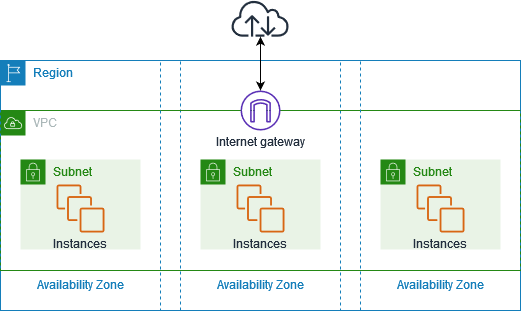

## beneficios do amazon vpc

- zonas de disponibilidades
- sub-redes (publica e privada)
- tabela de roteamento (tráfico da sub-rede)
- internet gateway (sub-rede publica) - concede acesso internet
- nat gateway (sub-rede privada)
- security groups (sg) e network access list (acls)

